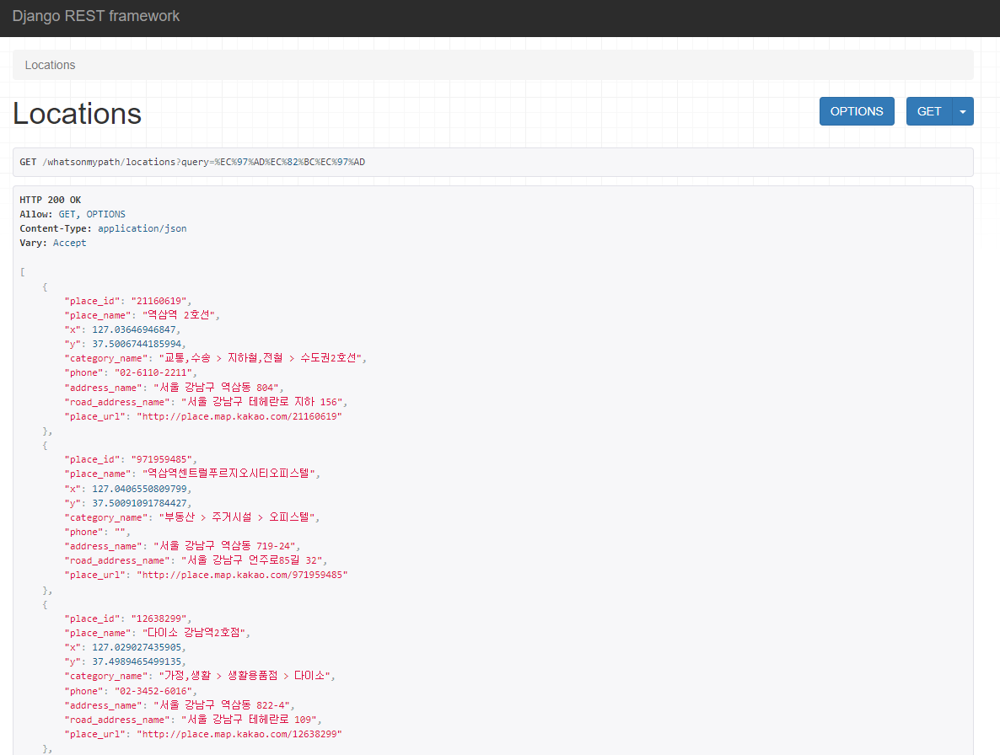

# What’s on My Path?

**Git:** https://github.com/HwiHwi523/Whats_on_My_Path

---

## ❓개요

친구들과 여행을 갔다가 돌아오던 중 순댓국을 먹기로 했는데, 돌아오는 경로에 순댓국을 판매하는 식당이 거의 존재하지 않았습니다. 인터넷에 검색을 해도 정말 광범위한 결과만 볼 수 있었습니다.
그래서 **특정 경로를 따라 위치해 있는 가게들을 찾을 수 있다면** 더욱 편리할 것이라고 생각하여 토이 프로젝트로 만들어 보게 되었습니다.

---

## 🛠️ 개발 스택

- Python
- Django
- API
- Bootstrap v5
- HTML, JavaScript, JSP

---

## 구현 문서

[1_API Server_Django](https://www.notion.so/1_API-Server_Django-619389b0a8734b5fae4be4304902c66d)

---

## 📊 알고리즘

1. 사용자가 **`시작 위치`**, **`도착 위치`**, **`찾고자 하는 가게의 키워드`**를 입력

1. 입력 받은 시작·도착 위치로 주위의 `**장소 데이터 목록**`을 얻기
    
    (장소 데이터 : 장소ID, 장소명, 지번, 도로명, 경도 및 위도, …)
    
    (Kakao 로컬 keyword API 사용)
    
2. 경도와 위도로 `**시작 위치에서 도착 위치로 가는 경로**` 얻기
    
    (경로: 시작 위치에서 도착 위치로 가는 각 지점의 경도 위도 목록)
    
    (Kakao 모빌리티 길찾기 API 사용)
    
3. 각 지점을 500M 단위로 자르며 `**주변 가게 목록**` 구하기
    1. 찾은 지점에서 반경 500M 거리 내의 장소들 구하기
        
        (위도·경도 간 거리 계산: haversine 라이브러리 사용)
        
        (Kakao 로컬 keyword API 사용)
        
4. **`구한 가게 목록`**과 **`마커로 위치를 표시한 지도(미구현)`**를 사용자에게 제공

---

## 📷 서비스 화면

- API Server (Django) - `/locations`, `query: 역삼역` 호출 결과
    
    
    
    
    

- API Server (Django) - `/paths`, `keyword: 국밥`, `departureLngLat: {망우역 경도,위도}`, `destinationLngLat: {청량리역 경도, 위도}`
    
    
    
- Web - 메인화면
    
    
    

- Web - ‘출발지 검색’ 또는 ‘도착지 검색’ 누를 시 (’장소명 입력’ 하는 폼 추가)
    
    
    

- Web - 출발지 또는 도착지 검색 시
    
    (특정 장소 클릭 시 해당 정보(장소명, 경도 및 위도)가 상단 폼으로 들어감, 경도 및 위도는 hidden)
    
    
    

- Web - 검색 결과 1 (**`역삼역`** → **`왕십리역`**, **`국밥`**)
(’이전’, ‘다음’ 버튼으로 다른 장소 확인 가능) `(경로 표시 아직 미구현)`
    
    
    

- Web - 검색 결과 2 (`**청량리역**` → `**광화문**`, `**편의점**`)
    
    
    

---

## 📈 문제점 & 개선방향

- 문제점
	- 출발지 주변의 식당들만 등장
    
- 개선방향
    - 사용자가 더욱 정확한 출발지와 도착지를 선택할 수 있도록
    - 사용자가 많이 검색하는 경로, 또는 해당 경로에 위치한 가게 정보를 매번 API로 불러오지
     않고 따로 저장해서 반환하도록 (검색 엔진 만들기?)
