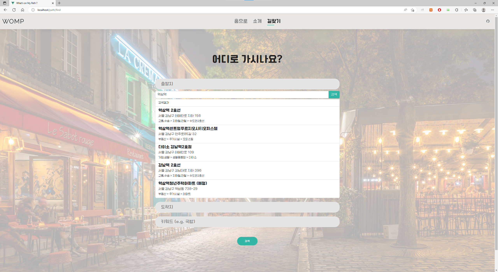
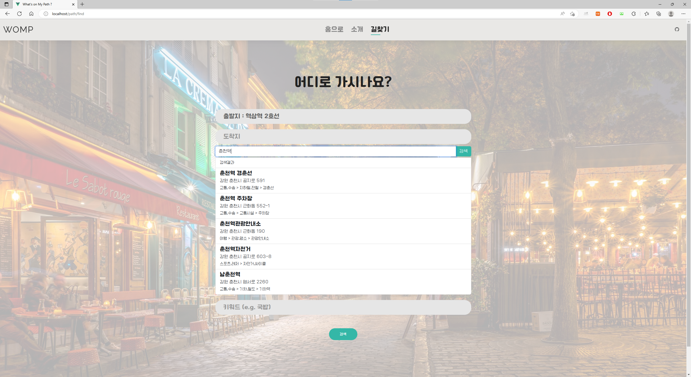
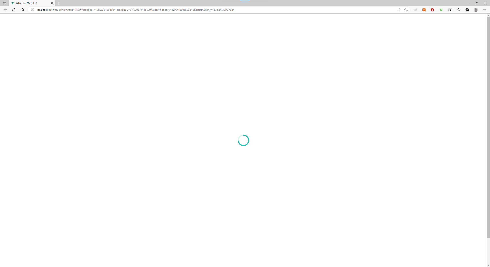
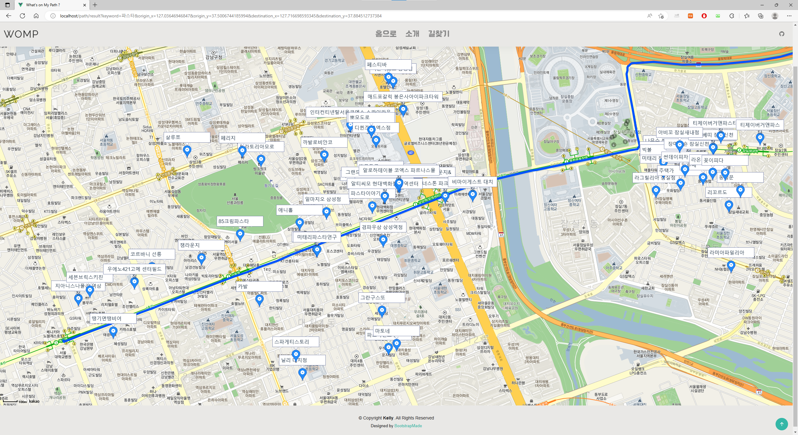
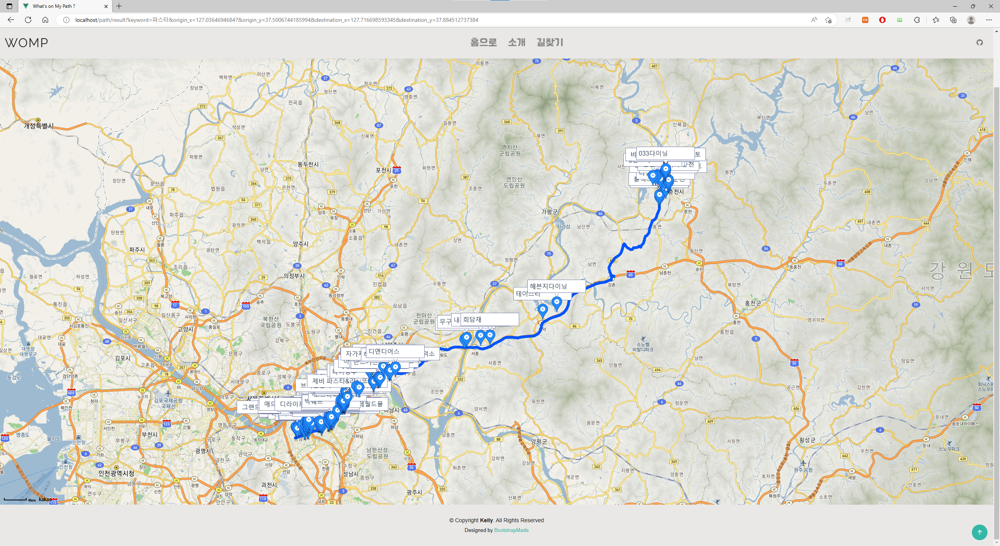

# What’s on My Path?

**Git:** https://github.com/HwiHwi523/Whats_on_My_Path

---

## ❓개요

친구들과 여행을 갔다가 돌아오던 중 순댓국을 먹기로 했는데, 돌아오는 경로에 순댓국을 판매하는 식당이 거의 존재하지 않았습니다. 인터넷에 검색을 해도 정말 광범위한 결과만 볼 수 있었습니다.
그래서 **특정 경로를 따라 위치해 있는 가게들을 찾을 수 있다면** 더욱 편리할 것이라고 생각하여 토이 프로젝트로 만들어 보게 되었습니다.

---

## 🛠️ 개발 스택

- Java
- Spring Boot
- Vue.js
- AWS

---

## 📊 알고리즘

1. 사용자가 `출발지`, `도착지`, `찾고자 하는 음식의 키워드`를 입력

1. `출발지` ↔ `도착지` 경로 구하기

   (카카오 모빌리티 길찾기 API)

1. 경로를 이루는 각 지점을 `1 KM` 단위로 자르며 `인근 음식점 목록` 구하기

   (카카오 로컬 API)

1. `구한 음식점 목록`과 `마커로 위치를 표시한 지도`를 제공

---

## 📷 서비스 화면

- Home

- 길찾기 정보 (출발지, 도착지, 음식 키워드) 입력 페이지

- ‘출발지’ 폼 클릭

- 출발지 입력 및 검색 (`역삼역` 검색 및 `역삼역 2호선` 선택)

- 도착지 입력 및 검색 (`춘천역` 검색 및 `춘천역 경춘선` 선택)

- `음식 키워드` 입력

- 검색 버튼 클릭 및 데이터 대기중

- 출발지 (역삼역) 인근 지도

- 출발지와 도착지 전체 지도

---

## 📈 문제점 & 개선방향

- 문제점

  1. 너무 긴 검색 시간

     (경로 길이에 따라 검색 범위를 넓히거나, 고속도로 한 가운데는 제외하기)

- 개선방향
  1. 음식점 마커 UI 개선하기
  2. 음식점 목록도 같이 제공하도록 UI 개선하기
  3. 검색 키워드 실시간 순위 제공하기
  4. 음식점 정보를 저장하고 자체적으로 키워드 검색 알고리즘을 만들어 API 호출 줄이기
